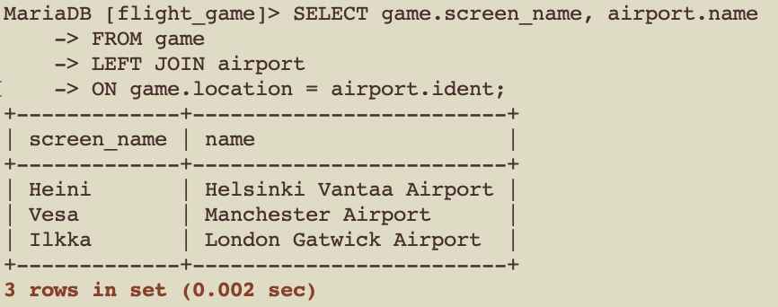
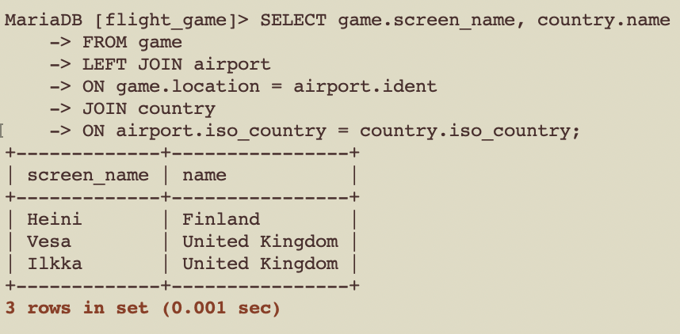
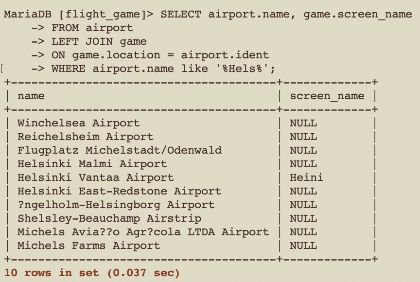
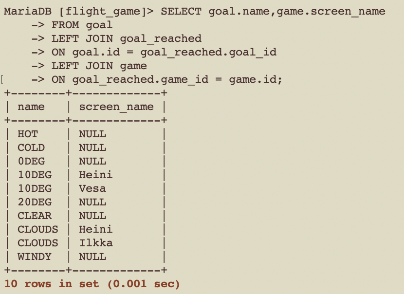

#week 4

## question 1
```
SELECT country.name AS 'country name', airport.name AS 'airport name'
FROM airport
JOIN country
ON airport.iso_country = country.iso_country
WHERE country.name = 'Finland'
AND airport.scheduled_service = 'yes';
```


## question 2
```
SELECT game.screen_name, airport.name
FROM game
LEFT JOIN airport
ON game.location = airport.ident;
```


## question 3

```
SELECT game.screen_name, country.name
FROM game
LEFT JOIN airport
ON game.location = airport.ident
JOIN country
ON airport.iso_country = country.iso_country;
```



## question 4
```
SELECT airport.name, game.screen_name
FROM airport
LEFT JOIN game
ON game.location = airport.ident
WHERE airport.name like '%Hels%';
```


## question 5
```
SELECT goal.name,game.screen_name
FROM goal
LEFT JOIN goal_reached
ON goal.id = goal_reached.goal_id
LEFT JOIN game
ON goal_reached.game_id = game.id;
```
