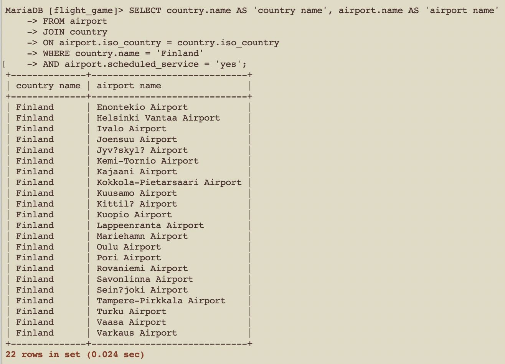

#week 4

## question 1
'''
SELECT country.name AS 'country name', airport.name AS 'airport name'
FROM airport
JOIN country
ON airport.iso_country = country.iso_country
WHERE country.name = 'Finland'
AND airport.scheduled_service = 'yes';
'''

## question 2
