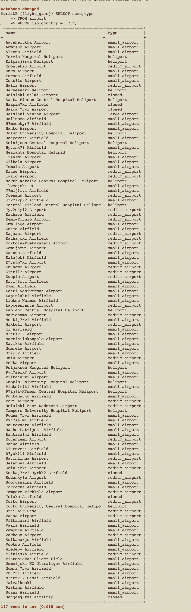

## week 3 exercise 2

## question 1
```
SELECT name,type 
FROM airport 
WHERE iso_country = 'FI';
```


## question 2
```
SELECT name,type 
FROM airport 
WHERE iso_country = 'FI';
```


## question 3
```
SELECT name FROM airport 
WHERE iso_country = 'FI' 
ORDER BY name ASC;
```


## question 4
```
SELECT name,type 
FROM airport
WHERE iso_country = 'FI'
ORDER BY type ASC, name ASC;
```


## question 5
```
SELECT name FROM country
WHERE name LIKE 'F%';
```


## question 6
```
SELECT name FROM country 
WHERE name LIKE '%f%' or 'F%';
```


## question 7
```
SELECT location 
FROM game 
WHERE screen_name = 'Vesa';
```


## question 8 
```
SELECT co2_consumed FROM game 
WHERE screen_name = 'Ilkka';
```


## question 9
```
SELECT co2_budget 
FROM game LIMIT 1;
```


## question 10
```
SELECT TRIM(screen_name) 
AS screen_name, co2_budget, co2_consumed, (co2_budget - co2_consumed) AS co2_left 
FROM game 
WHERE TRIM(screen_name) = 'Ilkka';
```


## Exercise 3 
## question 1
```
SELECT country.name AS 'country name', airport.name AS 'airport name' 
FROM airport, country 
WHERE airport.iso_country = country.iso_country and country.name = 'Iceland';
```


## question2
```
SELECT airport.name AS 'airport name' 
FROM airport, country 
WHERE airport.iso_country = country.iso_country 
AND country.name = 'France' 
AND airport.type = 'large_airport';
```


```
SELECT airport.name AS 'airport name' 
FROM airport 
JOIN country 
WHERE airport.iso_country = country.iso_country 
and country.name = 'France' 
and airport.type = 'large_airport';
```


## question 3
```
SELECT country.name AS 'country_name', airport.name AS 'airport_name'
FROM airport, country
WHERE airport.iso_country = country.iso_country
AND airport.continent = 'an';
```


```
SELECT country.name AS 'country_name', airport.name AS 'airport_name'
FROM airport
JOIN country
ON airport.iso_country = country.iso_country 
and airport.contient = 'an';
```


## question 4
```
SELECT airport.elevation_ft
FROM airport, game
WHERE game.location = airport.ident
AND game.screen_name = 'Heini';
```


```
SELECT airport.elevation_ft
FROM airport
JOIN game
On game.location = airport.ident
WHERE game.screen_name = 'Heini';
```


## question 5
```
SELECT airport.elevation_ft * 0.3048 AS elevation_m
FROM airport, game
WHERE game.location = airport.ident
AND game.screen_name = 'Heini';
```


```
SELECT airport.elevation_ft * 0.3048 AS elevation_m
FROM airport
JOIN game
On game.location = airport.ident
WHERE game.screen_name = 'Heini';
```


## question 6
```
SELECT airport.name
FROM airport, game
WHERE game.location = airport.ident
AND game.screen_name = 'Ilkka';
```


```
SELECT airport.name
FROM airport
JOIN game
On game.location = airport.ident
WHERE game.screen_name = 'Ilkka';
```


## question 7
```
SELECT country.name
FROM airport, game, country
WHERE game.location = airport.ident
AND airport.iso_country = country.iso_country
AND game.screen_name = 'Ilkka';
```


```
SELECT country.name
FROM airport
JOIN game
ON game.location = airport.ident
JOIN country
ON airport.iso_country = country.iso_country 
WHERE game.screen_name = 'Ilkka';
```


## question 8
```
SELECT goal.name
FROM goal, goal_reached, game
WHERE goal.id = goal_reached.goal_id
AND game.id = goal_reached.game_id
AND game.screen_name = 'Heini';
```


```
SELECT goal.name 
FROM goal 
JOIN goal_reached 
ON goal.id = goal_reached.goal_id 
JOIN game 
ON game.id = goal_reached.game_id 
WHERE game.screen_name = 'Heini';
```


## question 9
```
SELECT airport.name
FROM airport, game, goal_reached, goal
WHERE game.location = airport.ident
AND game.id = goal_reached.game_id
AND goal.id = goal_reached.goal_id
AND game.screen_name = 'Ilkka'
AND goal.name = 'clouds';
```


```
SELECT airport.name
FROM airport
JOIN game
ON game.location = airport.ident
JOIN goal_reached
ON game.id = goal_reached.game_id 
JOIN goal
ON goal.id = goal_reached.goal_id 
WHERE game.screen_name = 'Ilkka'
AND goal.name = 'clouds';
```


## question 10
```
SELECT country.name
FROM country, airport, game, goal_reached, goal
WHERE airport.iso_country = country.iso_country
AND game.location = airport.ident
AND game.id = goal_reached.game_id
AND goal.id = goal_reached.goal_id
AND game.screen_name = 'Ilkka'
AND goal.name = 'clouds';
```


```
SELECT country.name
FROM country
JOIN airport
ON airport.iso_country = country.iso_country
JOIN game
ON game.location = airport.ident
JOIN goal_reached
ON game.id = goal_reached.game_id 
JOIN goal
ON goal.id = goal_reached.goal_id 
WHERE game.screen_name = 'Ilkka' and goal.name = 'clouds';
```

