##Week5 Exercise6

##question 1
What is the elevation of the highest airport location?
```
SELECT 
(SELECT MAX(elevation_ft)
    FROM airport)
AS "max(elevation_ft)";
```
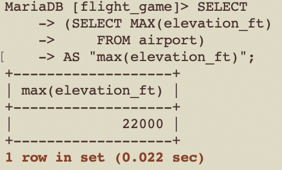

## question 2
Write a query that lists all continents and the number of countries on them.
```
SELECT continent, COUNT(DISTINCT iso_country) AS "count(*) "
FROM airport
GROUP BY continent;
```
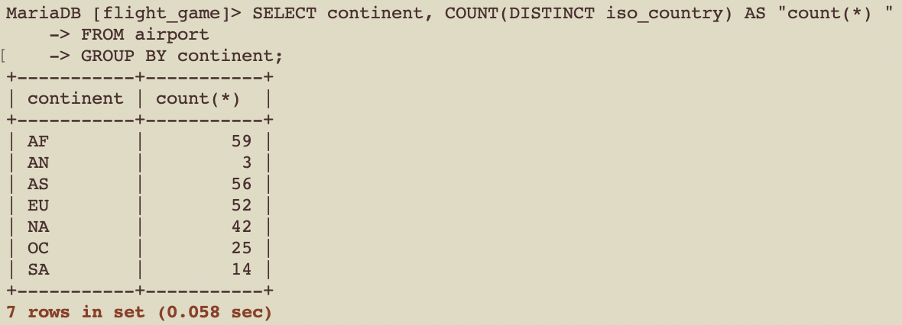

## question 3
List the names of all players and the number of weather goals they have achieved.
```
SELECT game.screen_name, count(*) from game
JOIN goal_reached
ON goal_reached.game_id = game.id
GROUP BY game.screen_name;
```
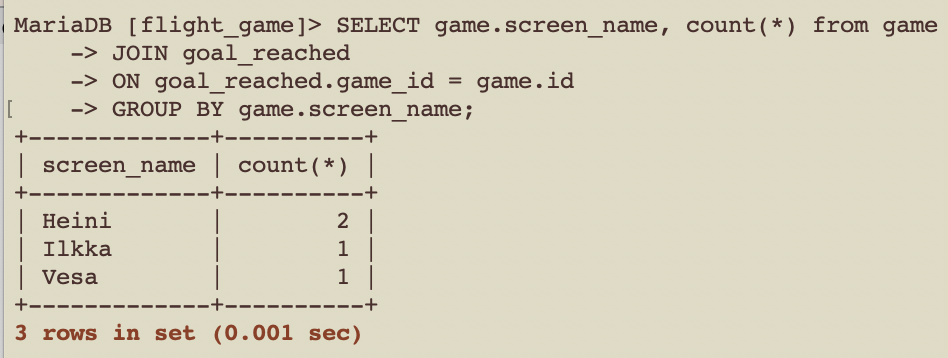

## question 4
Which player has the smallest carbon foot print?
```
SELECT screen_name
FROM game
WHERE co2_consumed in(
    SELECT min(co2_consumed)
    FROM game
);
```
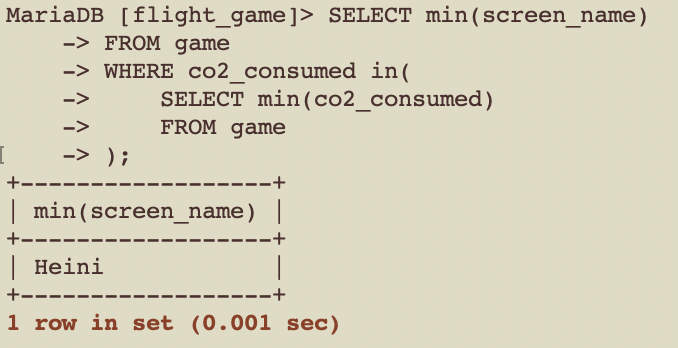

## question 5
Print out the names of all countries and the number of airports in each country. Order the results by the airport count in descending order. Only include the top 50 countries with the largest number of airports.
```
SELECT country.name, count(*) 
FROM airport
JOIN country 
ON airport.iso_country = country.iso_country
GROUP BY country.name
ORDER BY count(*) DESC
LIMIT 50;
```
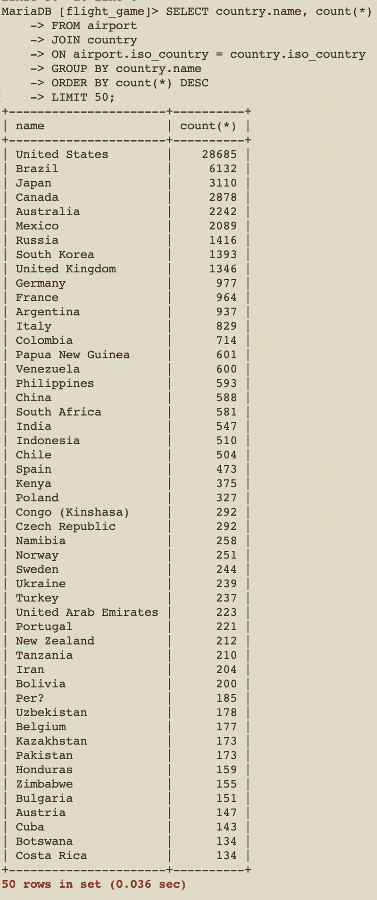

## question 6
List the countries with more than 1000 airports. Use the iso_country field in the query.
```
SELECT country.name 
FROM airport
JOIN country 
ON airport.iso_country = country.iso_country
GROUP BY country.name
HAVING count(airport.iso_country) >= 1000;
```
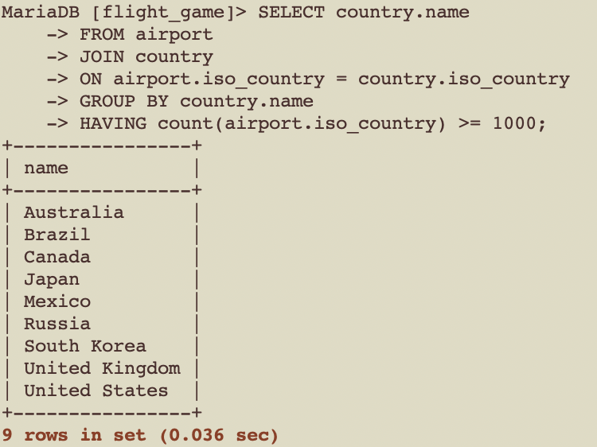

## question 7
Print out the name of the highest airport in the world.
```
SELECT name FROM airport
WHERE elevation_ft in 
    (SELECT max(elevation_ft) FROM airport);
```
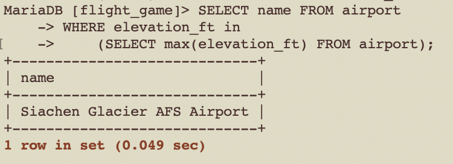

## question 8
In which country does the highest airport reside in?
```
SELECT country.name 
FROM airport
JOIN country 
ON airport.iso_country = country.iso_country
WHERE elevation_ft in 
    (SELECT max(elevation_ft) FROM airport);
```
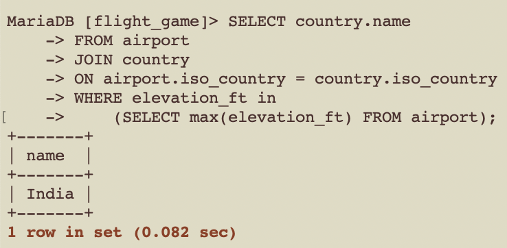

## question 9
How many weather goals has Vesa achieved so far?
```
SELECT count(*)
FROM game
JOIN goal_reached
ON game.id = goal_reached.game_id
JOIN goal
ON goal.id = goal_reached.goal_id
WHERE screen_name in 
    (SELECT screen_name FROM game 
    WHERE screen_name = 'Vesa');
```
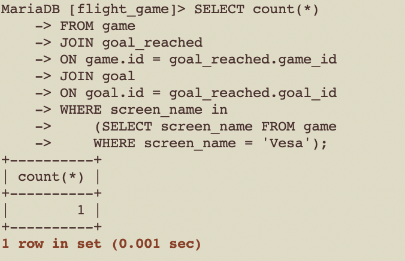

## question 10
What is the name of the airport that resides closest to the polar regions?
```
SELECT name 
FROM airport
WHERE latitude_deg in 
    (SELECT min(latitude_deg) FROM airport);
```


## exercise6
## question1
Vesa flies from his current location to the Nottingham Airport. At the same time, Vesa's carbon footprint increases by 500. Update the information to the database.
Hint 1: You need to use a subquery to find out the ident value of Nottingham Airport.
```
START TRANSACTION; #use innoDB to rollback incase updated information is wrong;
UPDATE game
SET co2_consumed = 3500, 
    location = (SELECT ident FROM airport WHERE name= 'Nottingham Airport')
WHERE game.screen_name = 'Vesa';
COMMIT; 
```
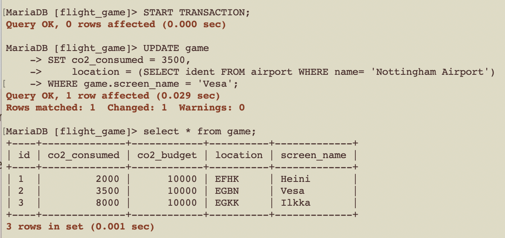

## question 2
Do you have to delete data first from the game table or from the goal_reached table?
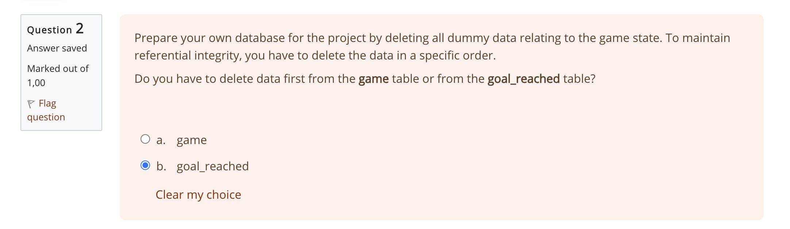

## question 3&4
Delete the dummy data from the goal_reached table.
Delete the data from the game table.
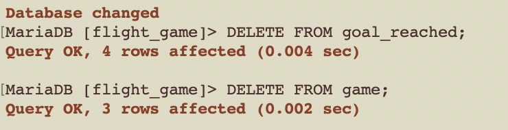
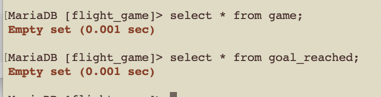


